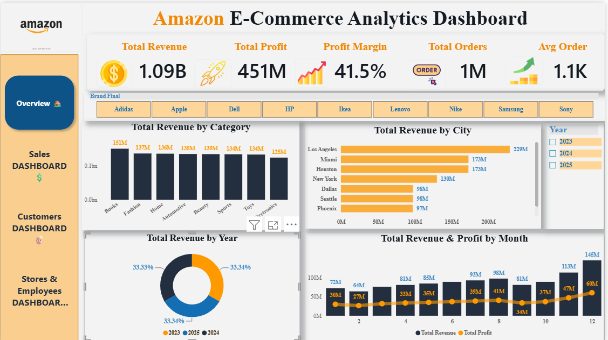
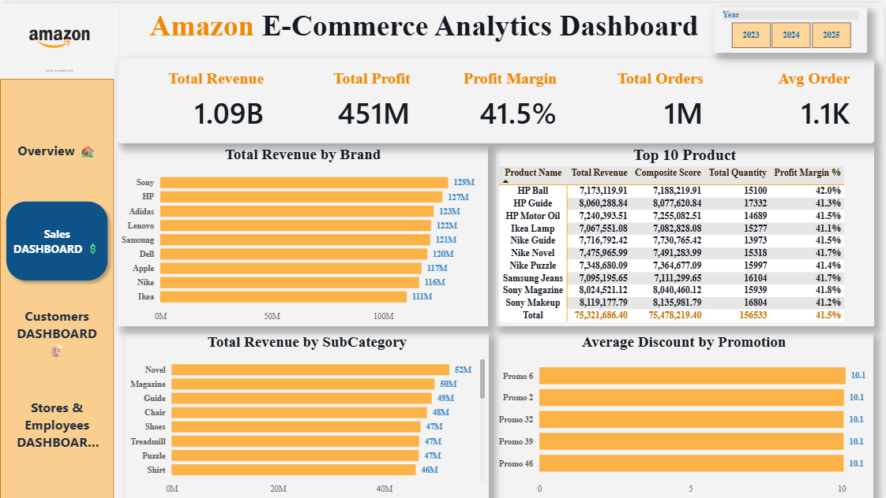
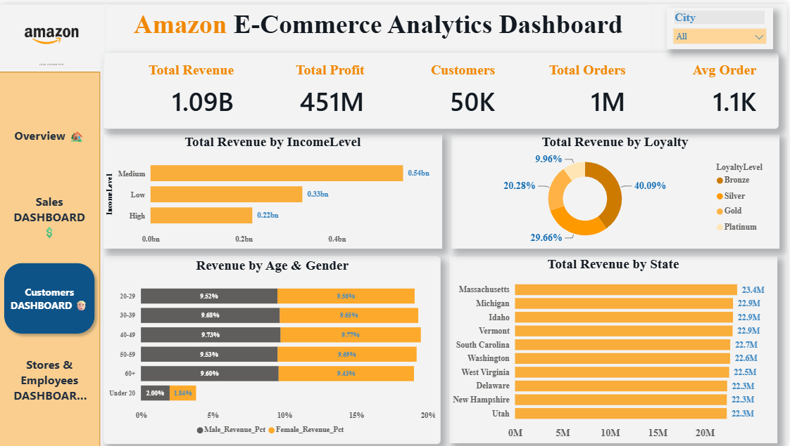
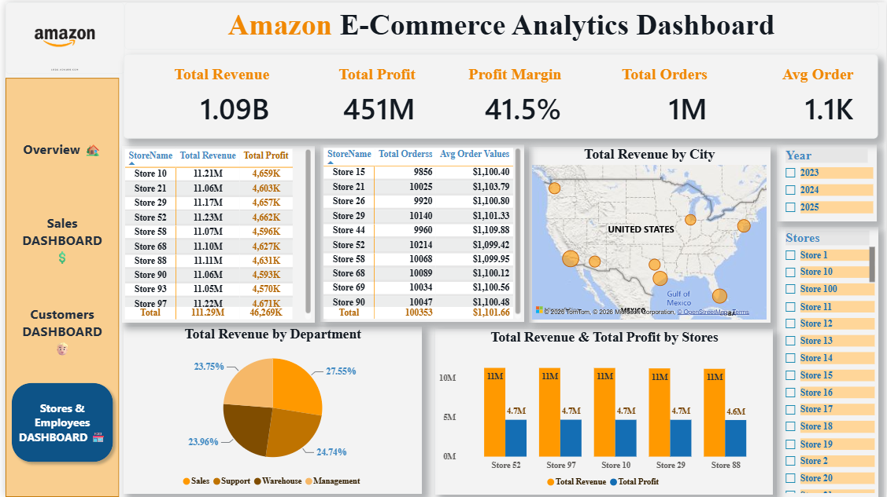

# 🛒 E-Commerce Analytics Dashboard
### Multi-Page Power BI Solution — Sales, Customers &amp; Store Performance

---

## 📌 Overview

A 4-page Power BI analytics solution built on a large-scale e-commerce dataset (1M+ orders, 50K customers, 100 stores) covering sales performance, customer behavior, and store/employee operations. Designed as an end-to-end BI portfolio project demonstrating data modeling, DAX, and executive-level dashboard design at scale.

## 🎯 Business Problem

E-commerce stakeholders need visibility into revenue drivers across product categories, cities, and brands, plus deeper insight into customer segments (income level, loyalty tier, age/gender) and per-store operational performance — all in one interactive, drillable tool.

## 🛠️ Tools &amp; Technologies

<table>
<tr><td><b>BI Tool</b></td><td>Power BI Desktop &amp; Service</td></tr>
<tr><td><b>Data Modeling</b></td><td>DAX measures (Revenue, Profit Margin %, Avg Order Value, Composite Score)</td></tr>
<tr><td><b>Data Prep</b></td><td>Power Query (M Language)</td></tr>
<tr><td><b>Visuals</b></td><td>Filled maps, donut charts, ranked tables, KPI cards, brand/category breakdowns</td></tr>
<tr><td><b>Scale</b></td><td>1M+ orders · 50K customers · 100 stores</td></tr>
</table>

## ✨ Key Features (4 Dashboard Pages)

**1. Overview**
- Total Revenue, Total Profit, Profit Margin %, Total Orders, and Average Order Value KPI cards.
- Revenue breakdown by product category, by city, by year, and monthly revenue-vs-profit trend.
- Brand filter bar (Adidas, Apple, Dell, HP, Ikea, Lenovo, Nike, Samsung, Sony).

**2. Sales Dashboard**
- Revenue ranked by brand.
- Top 10 products table with revenue, composite score, quantity, and profit margin %.
- Revenue by sub-category and average discount by promotion.

**3. Customers Dashboard**
- Revenue by income level (Low/Medium/High) and by loyalty tier (Bronze/Silver/Gold/Platinum).
- Revenue by age group and gender.
- Revenue by state, with customer count and average order KPIs.

**4. Stores &amp; Employees Dashboard**
- Store-level revenue and profit ranking table.
- Store-level order count and average order value table.
- Geographic store map across the United States.
- Revenue by department (Sales, Support, Warehouse, Management).

## 📈 Dashboard Preview

<!-- [ADD: ] -->
<!-- [ADD: ] -->
<!-- [ADD: ] -->
<!-- [ADD: ] -->
<i>4-page dashboard: Overview · Sales · Customers · Stores &amp; Employees</i>

## 🔍 Approach

1. **Data Preparation** — Cleaned and modeled order, customer, product, and store datasets using Power Query.
2. **Data Modeling** — Built a relational model connecting orders, products, customers, and stores; created DAX measures for revenue, profit margin, composite product score, and average order value.
3. **Dashboard Design** — Structured 4 focused pages (Overview, Sales, Customers, Stores &amp; Employees) with consistent navigation and branding, so each stakeholder group can find relevant KPIs quickly.
4. **Interactivity** — Added brand, year, and city filters/slicers across pages for drill-down analysis.

## 📊 Key Insights

<!-- [ADD: any takeaway, e.g. "Electronics and Books together drive the largest share of category revenue" or "Gold/Platinum loyalty customers show disproportionately higher average order value."] -->

## 🔒 Note on Data

This project uses a large-scale sample/practice dataset built to mirror real e-commerce analytics scenarios. Company and brand names shown are used for illustrative/learning purposes only and do not represent real company data or an official affiliation.

---

**Sameh El-Hosary** | Data Analyst &amp; Business Intelligence Analyst
[LinkedIn](https://linkedin.com/in/sameh-el-hosary-) · [GitHub](https://github.com/SamehElhosary0) · [Email](sameh.sabry656@gmail.com)

